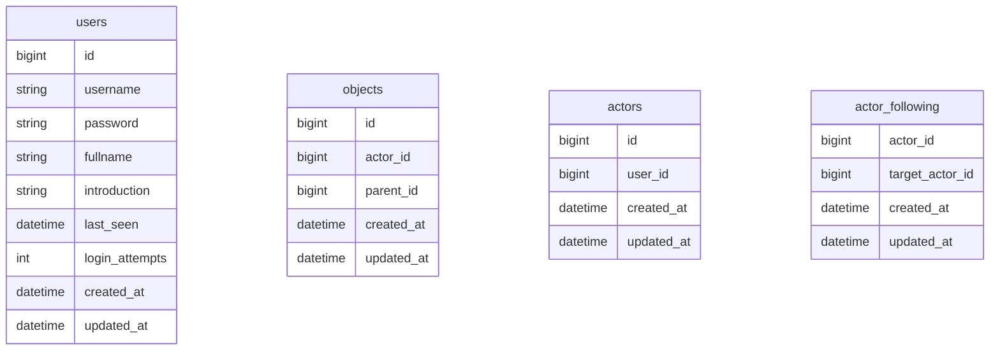

# Notes

* A user is local to the system, and also a fediverse actor
* A user can establish an authenticated session and be authorized to publish, manage, etc objects / other entities in the system
* An actor is not necessarily a user