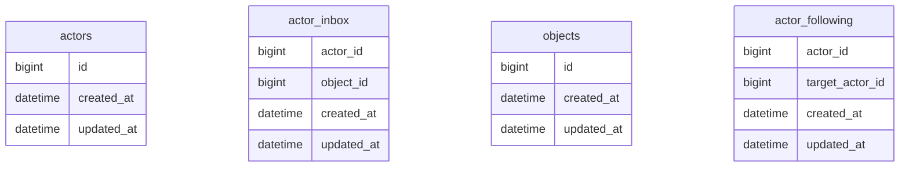

```mermaid
erDiagram
    actors {
        bigint id
        datetime created_at
        datetime updated_at
    }

    actor_inbox {
        bigint actor_id
        bigint object_id
        datetime created_at
        datetime updated_at
    }

    objects {
        bigint id
        datetime created_at
        datetime updated_at
    }
    
    actor_following {
        bigint actor_id
        bigint target_actor_id
        datetime created_at
        datetime updated_at
    }
```